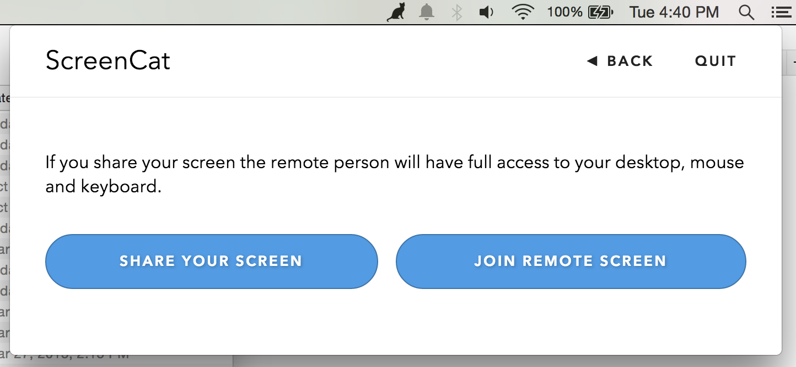
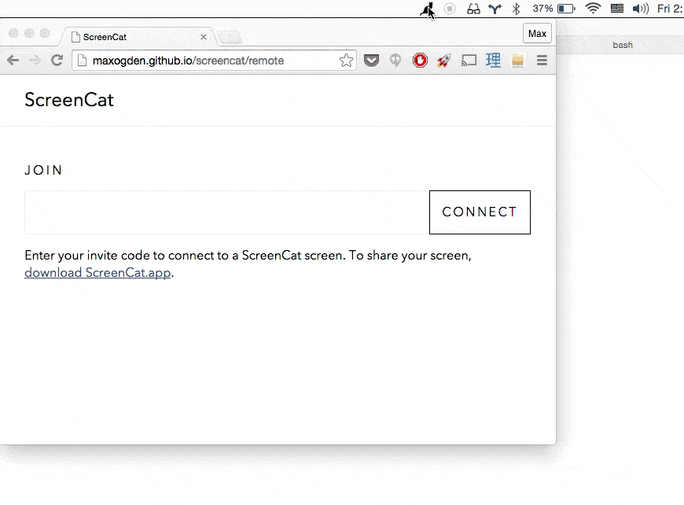

### ScreenCat


ScreenCat is an open source screen sharing + remote collaboration application, currently only for Mac OS. You can share your desktop with someone else while letting them share your mouse and keyboard remotely. Right now it is not as good as commercial alternatives, mostly because this initial prototype was written in 3 days. The big difference is that you can send PRs to make ScreenCat better!

ScreenCat is named after cats, but also for the idea of 'catting' a screen (as in unix cat). It has two C/C++ dependencies, [Atom Shell](https://github.com/atom/atom-shell) (which includes iojs) and [robotjs](https://github.com/octalmage/robotjs) for creating mouse + keyboard events.

ScreenCat is currently **ALPHA STATUS** and is intended for developers/early adopters. Check out the Issues to get involved. ScreenCat is a volunteer run project, your contributions and improvements are welcome!

To download the latest version visit the [releases page](https://github.com/maxogden/screencat/releases)

[](https://github.com/feross/standard)

[](https://travis-ci.org/maxogden/screencat)



### How it works

The app itself is written in JS, HTML and CSS. The CSS is from [tachyons](https://www.npmjs.com/package/tachyons). The app is wrapped up in an [atom-shell](https://github.com/atom/atom-shell) application using the [menubar](https://www.npmjs.com/package/menubar) module.

One really cool feature of ScreenCat is the ability to screenshare with a normal browser. Using our [remote control page](http://maxogden.github.io/screencat/remote) you can send your invite code to a web user and they can remote control your computer. Currently Google Chrome is recommended. You can also screenshare between 2 `ScreenCat.app` users.



The screensharing takes advantage of an experimental feature built in to Chromium's WebRTC implementation called `chromeMediaSource: 'screen'`. This lets you share the host computers entire desktop over a WebRTC video channel. On the remote end, you can render the data in a `<video>` element.

To initiate the WebRTC connection both peers must swap [sdp](http://en.wikipedia.org/wiki/Session_Description_Protocol) connection information payloads. After compression, you can get the payloads down to about 1K. This is technically small enough to copy/paste through e.g. SMS, but it's on the larger side. Also you have to do a full round trip, where user A sends their code to user B, *and* vice versa before a connection can be established.

To simplify the connection process the app uses [cat-lobby](https://github.com/maxogden/cat-lobby), a minimal lobby server using HTTP and Server-Sent Events. This simply lets users swap SDP payloads without having to copy/paste large text blocks back and forth.

To hook up the mouse and keyboard, the remote end uses standard `mousedown` and `keydown` events and sends them over a WebRTC data channel to the host. On the host side the app must synthesize mouse and keyboard events on the host OS. This is the tricky part, and the only part where a custom native node addon (C++) is required. Luckily I found the [robotjs](https://github.com/octalmage/robotjs) project which while still being relatively new and rough around the edges still got the job done after [some modifications](https://github.com/maxogden/robotjs/tree/keyupdown).

Currently the app only works between Macs, mostly because of the pain that is translating between keycodes and keyboard layouts across operating systems. In the future we hope to support Mac, Windows and Linux 100%.

The motivation for making ScreenCat came from a lack of open source + easily hackable screen sharing tools. I collaborate with many remote open source developers and being able to customize the software we use to work together is important to me. ScreenCat will remain free and BSD licensed, and your contributions are welcome! Check out the [issues](https://github.com/maxogden/screencat/issues), especially those marked as `help wanted`.

##### Developing

```bash
npm install # installs atom-shell and all the deps
npm run app # runs the app in the atom-shell wrapper
npm run build # builds the mac app
```

To get `robotjs` to compile correctly for use inside `atom-shell`, you have to either run `npm install` using the same version of `iojs` that is being used by the version of `atom-shell` you wish to use, or you can run e.g. `export ATOM_NODE_VERSION=0.22.1 && apm install .` inside the `screencat` directory (assuming you have `apm` installed).
